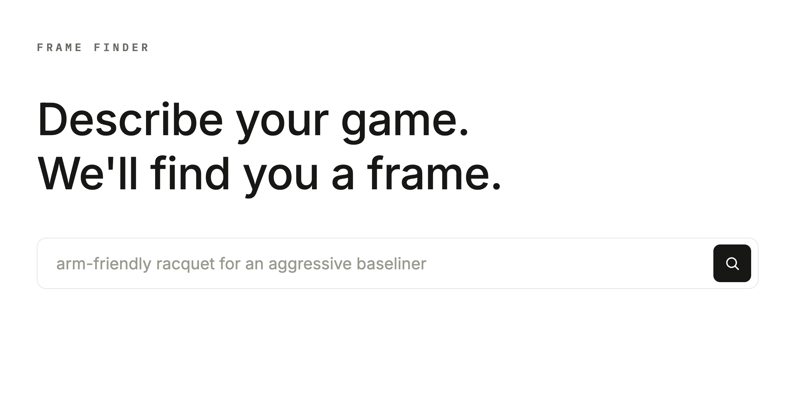

# Frame Finder

**Describe your game. We'll find you a frame.**

Frame Finder is a natural-language search engine for tennis racquets. Instead of
filtering by dropdown specs, players describe how they play — their level, style,
and what they're looking for in plain English — and Frame Finder surfaces the
frames that fit, ranked by relevance.

**Live app:** [frame-finder.up.railway.app](https://frame-finder.up.railway.app/)



---

## What it does

A user types something like *"arm-friendly racquet for an aggressive baseliner with
a big topspin forehand"* and gets back a ranked list of racquets drawn from Tennis
Warehouse's full catalogue (> 300 adult frames across 11 brands), each with a match
score, specs, description, and a link to the product listing.

The core problem Frame Finder aims to solve: racquet search is normally either rigid
(exact-match spec filters) or based on what your favorite player endorses. Racquet nerds scour forums and YouTube to translate their requirements into recommendations, but there's no easy, direct way to search by feel and playstyle. 
Frame Finder uses a hybrid retrieval pipeline to bridge natural-language
intent and the underlying racquet data.

---

## How it works

### Retrieval architecture

Frame Finder combines three ideas into one ranking pipeline:

1. **LLM query parsing** — an LLM parses the raw query into a `semantic_query`
   (natural-language intent for embedding search) and a `keyword_query` (mapped to
   lexical category terms for BM25). The LLM acts as a *translator*, not a domain
   expert: domain knowledge is encoded into the schema and prompt at design time;
   the model performs narrow NLP translation at runtime. Parsing failures fall back to the raw query.

2. **Hybrid search** — the parsed query runs through two independent retrievers:
   - **Semantic search** (cosine similarity over `sentence-transformers` embeddings)
     against LLM-distilled, feel-focused racquet descriptions.
   - **BM25 lexical search** over a concatenated text field (name, power level,
     stroke style, swing speed, distilled description).

   The two retrievers deliberately use *different* text fields — semantic search
   uses only the distilled description to avoid lexical/brand pollution in the
   embedding space, while BM25 gets the broader concatenated blob.

3. **Reciprocal Rank Fusion (RRF)** — the two ranked lists are fused via RRF rather
   than weighted score blending. RRF fuses by rank position, not score magnitude,
   which sidesteps the need for tuned weights — weights aren't defensible without
   labeled relevance data, so RRF avoids the problem entirely.

### Data pipeline

```
scrape → clean → distill → build artifacts
```

- **Scrape** (`scrape.py`) — pulls racquet data from Tennis Warehouse via
  `requests` + `BeautifulSoup`.
- **Clean** (`clean.py`) — normalizes the raw scraped data.
- **Distill** (`distill.py`) — an LLM rewrites each racquet's marketing copy into a
  concise, feel-focused description (power, control, spin, feel, maneuverability,
  suitability), extracting only what's explicitly stated. Batched with retry logic
  and partial-save recovery.
- **Build artifacts** (`build_processed_artifacts.py`) — merges the data, builds
  the embedding matrix, and writes the serving-time artifacts
  (`racquet_data_artifact.csv`, `embedding_artifacts.npz`).

### Web application

- **FastAPI** JSON API serving a static frontend.
- `RacquetSearchEngine` is loaded once at startup via FastAPI's lifespan; CPU-bound
  search runs in a threadpool to avoid blocking the event loop.
- **Search logging & feedback** — every search and every result shown is logged to
  Postgres (impression-level), with a thumbs-up feedback endpoint for collecting
  relevance signal for offline evaluation.
- **Rate limiting** via `slowapi` (per-IP).
- Deployed on **Railway** with managed Postgres, containerized via Docker.

---

## Tech stack

| Layer | Tools |
|---|---|
| Retrieval | `sentence-transformers`, `bm25s`, RRF, `numpy` |
| Query parsing | Anthropic / Google Gemini via a provider-agnostic adapter |
| API | FastAPI, `slowapi`, `psycopg2` |
| Persistence | PostgreSQL (Railway) |
| Frontend | Vanilla HTML/CSS/JS (JSON API + DOM updates) |
| Deployment | Docker, Railway |
| Data | Tennis Warehouse (scraped) |

---

## Project structure

```
frame-finder/
├── Dockerfile
├── pyproject.toml
├── src/frame_finder/         # Core library (no HTTP knowledge)
│   ├── scrape.py             # Tennis Warehouse scraper
│   ├── clean.py              # Raw data cleaning
│   ├── distill.py            # LLM description distillation
│   ├── dataset.py            # Data merging + keyword-text construction
│   ├── adapters.py           # Provider-agnostic LLM adapters
│   ├── parse_query.py        # Query → semantic + keyword parsing
│   ├── embed.py              # Embedding + semantic search
│   ├── bm25.py               # BM25 indexing + search
│   ├── engine.py             # RacquetSearchEngine (orchestrates hybrid search)
│   ├── config.py             # Config, prompts, scraping constants
│   └── cli.py                # CLI entry point
├── app/                      # FastAPI HTTP layer
│   ├── main.py               # App + lifespan
│   ├── dependencies.py       # get_engine, get_db
│   ├── schemas.py            # Request/response models
│   ├── database.py           # Postgres table setup
│   ├── limiter.py            # Rate limiter
│   └── routers/              # search, feedback, health
├── frontend/                 # Static HTML/CSS/JS
├── scripts/                  # Pipeline scripts
├── data/                     # raw → interim → processed
└── docs/decisions/           # Architecture Decision Records
```

---

## Running locally

```bash
# Install (installs dependencies + the local frame_finder package)
pip install .

# Set environment variables (.env)
#   ANTHROPIC_API_KEY=...
#   DATABASE_URL=postgresql://...
#   TOKENIZERS_PARALLELISM=false

# Run the API + frontend
fastapi dev app/main.py
```

The CLI is also available for search without the web layer:

```bash
frame-finder "control-oriented racquet for a one-handed backhand"
```

---

## Design decisions

I used an Architecture Decision Record (ADR) to record each significant decision with its context, alternatives considered, and why they were rejected. See [`docs/decisions/`](docs/decisions/).

A few highlights:

- **RRF over weighted blending** — weights aren't defensible without labeled data.
- **LLM as translator, not domain expert** — domain knowledge lives in schema/prompt
  design; the model does narrow runtime translation.
- **Postgres over SQLite** — durable, queryable feedback data for offline eval,
  free on Railway, no ephemeral-filesystem issues.
- **Impression-level logging** — logging every shown result (not just liked ones)
  captures the implicit negative signal needed for Hit@N / MRR evaluation.

---

## Roadmap

- **Offline evaluation set**: labeled query set with Hit@N / MRR to quantify
  retrieval quality and diagnose failure modes.
- **Structured attribute retrieval (v2)**: incorporate the numeric specs the
  corpus already contains (head size, weight, balance, stiffness, swing weight) via
  a Pydantic filter DSL, fused as a third ranked list into RRF.
- **Incremental data pipeline**: change-detection-based updates so new/changed
  racquets are re-distilled and re-embedded without rebuilding everything.
- **Dependency pinning & lockfile**: pin versions for supply-chain integrity. (Considering switching to `uv`)

---

## Notes

Racquet data is sourced from [Tennis Warehouse](https://www.tennis-warehouse.com).
Frame Finder is an independent portfolio project and is not affiliated with Tennis
Warehouse. The MIT license only applies to the architecture and web app **not** the
data sourced from Tennis Warehouse. 